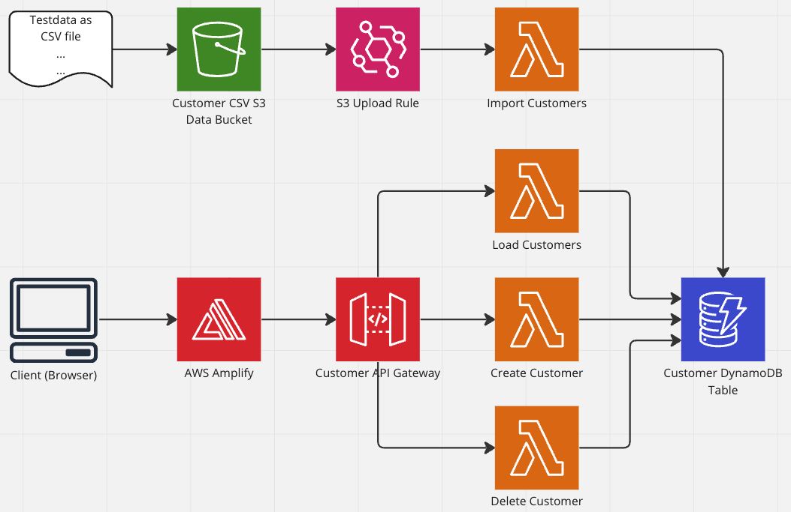

# aws-codewhisperer-app-experiment
This is a basic serverless application that was developed as an experiment for using AWS CodeWhisperer for programming.

# Experiment Overview

# CDK Setup of the App with projen
Creation of an import script `import.py`.

### What AWS CodeWhisperer did?
* 

### What did we do?
* 

### Problems
* 